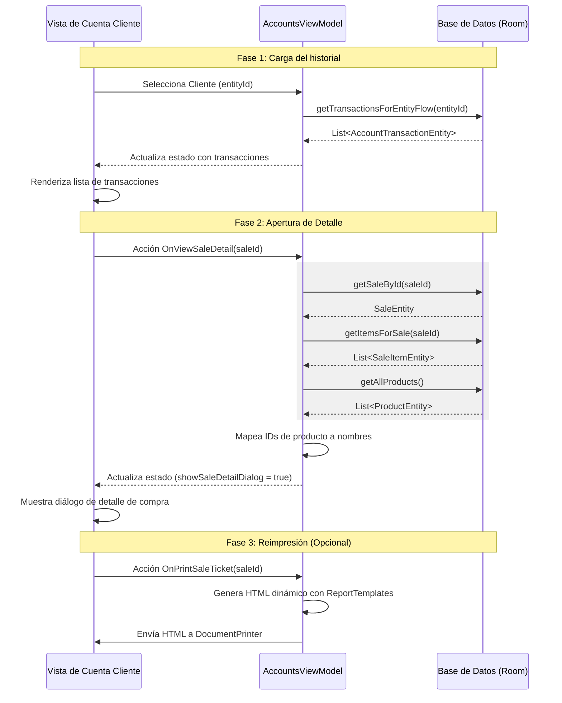

# Guía Técnica: Obtención de Detalles de Venta en la Cuenta de Clientes

Esta guía explica el flujo y la arquitectura implementados para consultar, mostrar y reimprimir el detalle de ventas asociadas a las Cuentas Corrientes de los clientes. Sirve como referencia técnica para la implementación de esta funcionalidad en otras aplicaciones.

---

## 1. Arquitectura de Datos (Modelos y Base de Datos)

El sistema utiliza tres tablas principales en la base de datos local (Room/SQLite) para gestionar este flujo:

### A. Transacciones de Cuenta (`AccountTransactionEntity`)
Representa cada movimiento de la cuenta corriente de un cliente (deudas por compras, pagos recibidos, etc.).
* **Campos clave:**
  * `id`: Identificador de la transacción.
  * `entityId`: ID del cliente (`customerId`).
  * `type`: Tipo de transacción (`DEBT` para deudas, `PAYMENT` para pagos).
  * `concept`: Breve descripción textual. Por ejemplo: `"Despacho Facturado N° SALE_1234"` o `"Venta Mostrador N° RETAIL_5678"`.
  * `amount`: Importe total del movimiento.
  * `date`: Timestamp de la transacción.

### B. Ventas (`SaleEntity`)
Representa el encabezado de la venta (minorista o mayorista).
* **Campos clave:**
  * `id`: ID único de la venta. Las ventas mayoristas comienzan con el prefijo `SALE_` y las minoristas (mostrador) con `RETAIL_`.
  * `customerId`: ID del cliente registrado asociado.
  * `consumerName`: Nombre del consumidor final (para ventas minoristas sin cuenta formal).
  * `totalAmount`: Importe total de la venta.
  * `paymentJson`: JSON serializado con los detalles del cobro (`PaymentEntry`).

### C. Ítems de la Venta (`SaleItemEntity`)
Representa cada renglón de productos despachados en una venta específica.
* **Campos clave:**
  * `saleId`: ID de la venta asociada (relación de clave foránea con `sales.id`).
  * `productId`: ID del producto vendido.
  * `weight`: Peso total del ítem en kilogramos (o cantidad de unidades).
  * `pricePerKg`: Precio por kilogramo en el momento de la venta.
  * `subtotal`: Peso/Cantidad × precio.

---

## 2. Flujo de Obtención de Datos

El flujo consta de tres fases secuenciales:



---

## 3. Consultas SQL (DAOs)

Para la implementación en otra aplicación, estas son las consultas SQL equivalentes que deben ejecutarse:

### Obtener el Historial de Transacciones del Cliente
```sql
SELECT * FROM account_transactions 
WHERE entityId = :customerId AND isDeleted = 0 
ORDER BY date DESC;
```

### Obtener una Venta por ID
```sql
SELECT * FROM sales 
WHERE id = :saleId LIMIT 1;
```

### Obtener los Ítems de la Venta
```sql
SELECT * FROM sale_items 
WHERE saleId = :saleId;
```

---

## 4. Lógica del ViewModel (Kotlin Multiplatform)

Al hacer clic en una venta del historial en Cuentas Corrientes, el ViewModel ejecuta la carga de datos de la siguiente manera:

```kotlin
// 1. Manejo de la acción en el ViewModel
is AccountsAction.OnViewSaleDetail -> {
    viewModelScope.launch {
        // Consultar la venta y sus ítems en la base de datos
        val sale = database.saleDao().getSaleById(action.saleId) ?: return@launch
        val items = database.saleDao().getItemsForSale(action.saleId)
        
        // Consultar todos los productos para mapear nombres y PLUs
        val products = database.productDao().getAllProducts()
        val productsMap = products.associateBy { it.id }
        
        // Mapear los ítems a objetos de dominio de la capa de presentación
        val domainItems = items.map { item ->
            SaleItem(
                productId = item.productId,
                weight = item.weight,
                pricePerKg = item.pricePerKg,
                subtotal = item.subtotal,
                barcode = item.barcode
            )
        }
        
        // Actualizar el estado de la UI para abrir el diálogo
        _state.update {
            it.copy(
                selectedSale = sale,
                selectedSaleItems = domainItems,
                selectedSaleProductsMap = productsMap,
                showSaleDetailDialog = true
            )
        }
    }
}
```

---

## 5. Renderizado en Interfaz de Usuario (UI Compose)

### Detección de Fila Cliqueable
En el listado de transacciones, la UI inspecciona el concepto para identificar si representa un comprobante cliqueable:
```kotlin
val conceptText = transaction.concept
val isSale = conceptText.contains("Despacho Facturado") || conceptText.contains("Venta Mostrador")

// Extracción del ID a partir del concepto
val saleId = if (isSale) {
    if (conceptText.contains("RETAIL_")) {
        "RETAIL_" + conceptText.substringAfter("RETAIL_").trim()
    } else {
        "SALE_" + conceptText.substringAfter("SALE_").trim()
    }
} else null
```
Si `saleId` no es nulo, la UI muestra el concepto con un estilo de hipervínculo cliqueable (ej. en color primario azul) que dispara `OnViewSaleDetail(saleId)`.

### Componentes del Diálogo de Detalle
El diálogo de detalle muestra la siguiente estructura:
1. **Encabezado:** Número de venta (extraído del ID), fecha formateada, nombre del cajero/operador y cliente.
2. **Tabla de Ítems:** Listado de productos comprados. Para cada producto se busca su nombre en el mapa: `productsMap[item.productId]?.name`. Muestra peso, precio por kilo y subtotal.
3. **Total:** Suma total facturada.
4. **Acción de Reimpresión:** Un botón que envía el `saleId` a la cola de impresión de la aplicación.

---

## 6. Lógica de Reimpresión de Comprobantes

Al invocar la reimpresión (`OnPrintSaleTicket`), la aplicación discrimina el tipo de ticket por su prefijo:

```kotlin
if (saleId.startsWith("RETAIL_")) {
    // Es una venta minorista de mostrador
    val payments = parsePaymentsJson(sale.paymentJson)
    val html = ReportTemplates.buildRetailTicket(
        saleId = sale.id,
        date = sale.date,
        consumerName = sale.consumerName ?: "Consumidor Final",
        items = domainItems,
        productsMap = productsMap,
        totalWeight = totalWeight,
        totalAmount = sale.totalAmount,
        payments = payments,
        operatorEmail = operatorEmail,
        butcheryName = butcheryName
    )
    documentPrinter.printHtml(html, "Ticket_Venta_${sale.id}")
} else {
    // Es una venta mayorista (Despacho)
    val customer = database.accountDao().getCustomerById(sale.customerId)
    val html = ReportTemplates.buildSalesTicket(
        saleId = sale.id,
        date = sale.date,
        customer = customer,
        items = domainItems,
        productsMap = productsMap,
        totalWeight = totalWeight,
        totalAmount = sale.totalAmount,
        operatorEmail = operatorEmail,
        butcheryName = butcheryName
    )
    documentPrinter.printHtml(html, "Ticket_Venta_${sale.id}")
}
```
